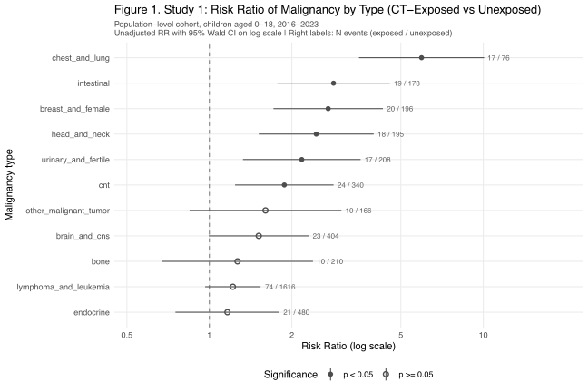
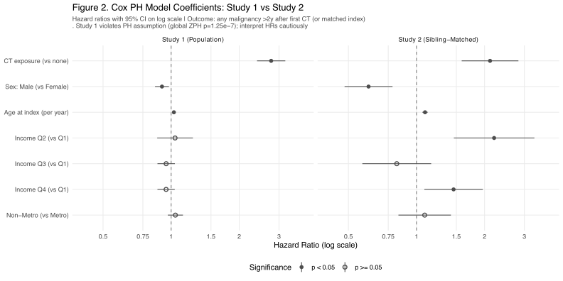
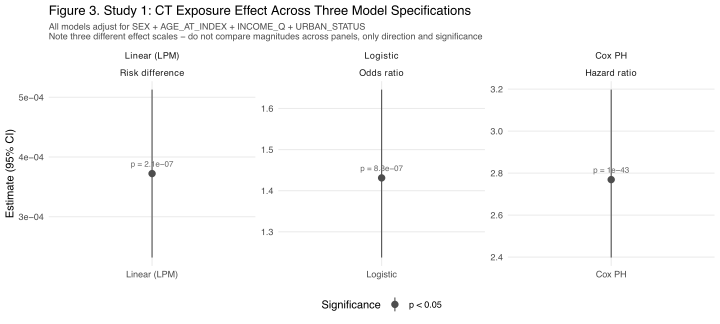
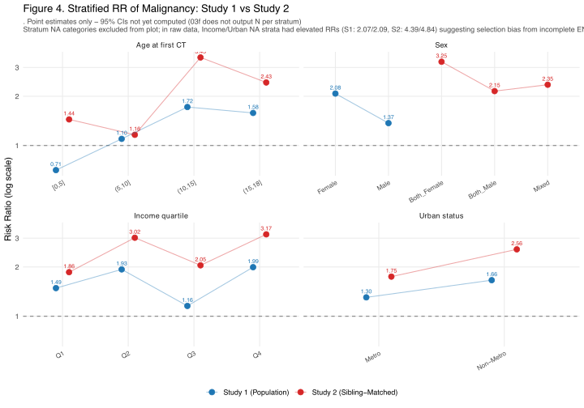

# 2026-05-08

# Taiwan CT Scan Exposure → Childhood Malignancy

> ⚠ **Status: Preliminary results — not for distribution.**
> The headline effect estimates in this report (Study 1 Cox HR ≈ 2.77, Study 2 HR ≈ 2.11) are **2–3× larger than published estimates from comparable cohorts** (Mathews 2013 IRR 1.24; Korea 2025 leukemia HR 1.07; EPI-CT 2023). This discrepancy is most likely driven by methodological choices in the current pipeline rather than a true Taiwan-specific signal. See **§8. Comparison with Prior Literature** and the expanded limitations sections within each study before interpreting any number in this report.

## 1. Study Aim

To examine whether **exposure to computed tomography (CT) during childhood (age 0–18)** is associated with **subsequent diagnosis of malignancy**, using Taiwan's National Health Insurance Research Database (NHIRD) covering 2000–2023.

The project comprises three nested study designs that progressively control for residual confounding:

| Study | Design | Comparator | Confounding Controlled |
|---|---|---|---|
| **Study 1** | Population-level cohort | All unexposed children | Measured covariates only (sex, age, income, residence) |
| **Study 2** | Sibling/twin-matched cohort | Unexposed sibling | Family-shared genetic + environmental confounders |
| **Study 3** | Appendicitis-restricted cohort | Appendectomy patients without abdominal CT | Indication confounding (children who get CT are sicker) |

---

## 2. Common Settings

### 2-1. Data Source

- **NHIRD** (National Health Insurance Research Database), accessed via HWDC (Health and Welfare Data Center)
- **Coverage**: 2000–2023, parquet format
- **Files used**:
  - `OPDTO` / `IPDTO` — outpatient / inpatient orders (CT procedure codes)
  - `OPDTE` / `IPDTE` — outpatient / inpatient claim headers (used to recover patient identity from order records)
  - `ENROL` — monthly insurance enrollment file (used for income proxy and inclusion verification)
  - `enrol-relation-extend.parquet` — household relationship file (sibling identification)

### 2-2. CT Identification

CT procedures are identified via NHI procedure codes recorded in `OPDTO.drug_no` and `IPDTO.order_code`:

| Code | Description |
|---|---|
| 33067B | Head CT — without contrast |
| 33068B | Head CT — with contrast |
| 33069B | Head CT — with/without contrast |
| 33070B | Body CT — without contrast |
| 33071B | Body CT — with contrast |
| 33072B | Body CT — with/without contrast |

⚠ NHI procedure codes carry no body-part granularity beyond head vs. body. For Study 3, the non-head subset (33070B–33072B) is used as a proxy for abdominal CT.

### 2-3. Malignancy Identification

Because the study window spans the ICD-9-CM → ICD-10-CM transition (2016 in Taiwan), malignancy ascertainment branches by year:

| Period | Coding | Malignancy codes |
|---|---|---|
| 2000–2015 | ICD-9-CM | **140–208** (3-digit prefix of `icd9cm_1`) |
| 2016–2023 | ICD-10-CM | **C00–C97** (3-character prefix of `icd9cm_1`) |

Diagnosis is taken from the first diagnosis field only (`icd9cm_1`). Malignancies are further grouped into 11 clinically meaningful types for stratified analysis:

| Group | ICD-10 range |
|---|---|
| Head and neck | C00–C14 |
| Intestinal (digestive tract) | C15–C26 |
| Chest and lung | C30–C39 |
| Bone | C40–C41 |
| Breast and female genital | C50–C58 |
| Urinary and male reproductive | C60–C68 |
| Brain and CNS | C70–C72 |
| Endocrine | C73–C75 |
| Other malignant tumors | C76–C80 |
| Lymphoma and leukemia | C81–C96 |
| Connective and soft tissue (cnt) | C45–C49 |

### 2-4. Exclusion Criteria

Applied to all three studies:

- **Existing malignancy at start of follow-up** — any malignancy diagnosis prior to the index date excluded
- **Hereditary cancer syndrome** — patients with a recorded hereditary cancer disorder (e.g., Li-Fraumeni, neurofibromatosis, retinoblastoma) excluded to avoid genetic-driven outcomes that would not reflect CT-induced risk

### 2-5. Insurance Enrollment Filter

To ensure cohort members were continuously insured (and therefore at risk of being observed if they developed malignancy), `ENROL` records are filtered as follows (post `tolower()` field names):

- `id_roc == "0"` — valid Taiwanese ID
- `id_status %in% c("1", "2", "3")` — active enrollment
- `ins_amt >= 2000` (i.e., `id1_amt`) — meaningful premium amount

### 2-6. Latency Period

A **2-year latency window** is applied between first CT exposure (or matched index date) and outcome ascertainment. Malignancies diagnosed within 2 years of CT exposure are excluded as **reverse causation** (the CT was likely ordered to investigate symptoms of an undiagnosed malignancy).

---

## 3. Study 1: Population-Level Cohort

### 3-1. Design

| Item | Specification |
|---|---|
| Inclusion | All children aged 0–18 with NHI enrollment between 2016–2023 |
| Exposure | At least one CT scan during follow-up |
| Outcome | New malignancy diagnosis > 2 years after first CT (or matched index date for unexposed) |
| Index date | First CT for exposed; randomly assigned date within study window for unexposed |
| Follow-up end | Earliest of: malignancy diagnosis, end of NHI enrollment, end of 2023 |

### 3-2. Statistical Analyses

Three complementary models were fitted, each adjusting for sex, age at index, income quartile, and urban/non-metro residence:

- **Linear regression (LPM)** — risk difference scale; outputs probability units
- **Logistic regression** — odds ratio scale
- **Cox proportional hazards** — hazard ratio scale; incorporates person-time

In addition, **unadjusted risk ratios (RRs)** were computed for each malignancy type with 95% Wald CIs on the log-RR scale. Stratified RRs were computed for sex, age at first CT, income quartile, and urban status.

### 3-3. Results — Unadjusted Risk Ratios by Malignancy Type *(preliminary)*

Six of eleven malignancy types show significantly elevated risk among CT-exposed children in this preliminary analysis:

| Malignancy type | RR (95% CI) | N events (exposed / unexposed) |
|---|---|---|
| Chest and lung | 5.95 (3.52–10.07) | 17 / 76 |
| Intestinal | 2.84 (1.77–4.56) | 19 / 178 |
| Breast and female | 2.72 (1.71–4.30) | 20 / 196 |
| Head and neck | 2.46 (1.52–3.98) | 18 / 195 |
| Urinary and male reproductive | 2.17 (1.33–3.57) | 17 / 208 |
| Connective and soft tissue (cnt) | 1.88 (1.24–2.84) | 24 / 340 |
| Brain and CNS | 1.51 (1.00–2.31) | 23 / 404 |
| Lymphoma and leukemia | 1.22 (0.97–1.54) | 74 / 1616 |
| Other malignant tumors | 1.60 (0.85–3.03) | 10 / 166 |
| Endocrine | 1.16 (0.75–1.80) | 21 / 480 |
| Bone | 1.27 (0.67–2.39) | 10 / 210 |

**Pattern interpretation — caution required.** The cancer types with the highest RRs (chest/lung, intestinal, breast) are precisely the types most susceptible to **reverse causation bias**: a CT performed during the diagnostic workup of a not-yet-diagnosed malignancy will be misclassified as a "cause" of the cancer that follows. Conversely, the lowest RR (lymphoma_and_leukemia, RR 1.22) corresponds to the malignancy type most resistant to reverse causation — leukemia is rarely diagnosed via CT — and is the most biologically established CT-related outcome (red bone marrow is the most radiosensitive pediatric tissue). The leukemia/lymphoma RR of 1.22 in our data is closely aligned with Korea 2025 (HR 1.07) and Mathews 2013 (IRR 1.24 for all cancers); the high RRs in solid-tumor categories likely reflect bias rather than radiation effect. See §3-7 for full discussion.

### 3-4. Results — Adjusted Cox Model *(preliminary)*

After adjusting for sex, age at index, income quartile, and residence:

| Variable | HR (95% CI) | p-value |
|---|---|---|
| **CT exposure (vs. none)** | **2.77 (2.40–3.20)** | < 0.001 |
| Sex: Male (vs. Female) | 0.91 (0.85–0.98) | 0.010 |
| Age at index (per year) | 1.03 (1.02–1.03) | < 0.001 |
| Income Q2 (vs. Q1) | 1.04 (0.87–1.25) | 0.667 |
| Income Q3 | 0.95 (0.87–1.04) | 0.262 |
| Income Q4 | 0.95 (0.87–1.04) | 0.254 |
| Non-Metro (vs. Metro) | 1.04 (0.97–1.13) | 0.270 |

CT-exposed children showed an apparent **2.77-fold higher hazard of malignancy** compared with unexposed children. Female sex and older age at index were also associated with higher risk. Income and urban status showed no meaningful association after adjustment.

### 3-5. Results — Three-Model Consistency

All three model specifications agree on the direction and significance of the CT exposure effect, despite operating on different effect scales (risk difference, odds ratio, hazard ratio). The Cox model yields the most extreme p-value because it explicitly incorporates differential follow-up time; exposed children accumulate more person-time at risk.

### 3-6. Results — Stratified Analyses 

Three patterns are notable in the Study 1 strata:

- **Age-at-first-CT shows a dose-response trend**: RR rises monotonically from 0.71 in age 0–5 to 1.72 in age 10–15, then stabilizes at 1.58 in age 15–18. Older children at exposure carry higher risk in absolute scale (consistent with longer accumulated radiation effect ≠ reverse causation in older adolescents).
- **Female sex carries higher RR than male** (2.08 vs. 1.37), consistent with known higher radiosensitivity of female breast and thyroid tissue.
- **Non-Metro residents show slightly higher RR than Metro** (1.66 vs. 1.30), which may reflect differential CT indications or healthcare access patterns.

### 3-7. Known Limitations of Study 1

This section enumerates the design issues most likely to explain why our preliminary Cox HR (2.77) substantially exceeds published estimates from comparable cohorts. Items 1–3 are the principal candidates for the inflation; items 4–7 are secondary issues.

#### 3-7-1. CT exposure rate (3.62%) is implausibly low *(principal concern)*
CT exposure rate (3.62%) is implausibly low (principal concern)
Our cohort yields 198,855 CT-exposed children among 5,490,109 (3.62%). For comparison, Mathews 2013 in Australia (1985–2005) found 6.2% exposure (680,211 / 10.9 M). Pediatric CT use rose sharply during the 2010s globally, so a 2016–2023 Taiwan cohort would be expected to have a higher exposure rate than 1985–2005 Australia, not roughly half. This raises strong concern that the CT-records pipeline is missing a substantial fraction of true exposures.

The most likely explanation is a data access gap rather than a linkage error: the current dataset does not include IPDTE (inpatient claim header file), which is required to recover patient identifiers for CT orders recorded in IPDTO. As a result, all CTs performed during inpatient admissions — a clinically important subset that includes post-trauma workups, pre-operative staging, and fever-of-unknown-origin evaluations — are silently excluded from the exposed cohort. The current pipeline effectively captures outpatient CTs only.

This introduces a directionally clear selection bias. Inpatient CTs are systematically ordered for sicker children than outpatient CTs. By excluding inpatient CTs, we are not randomly missing a fraction of exposures; we are missing the less severely ill inpatient-CT-exposed children who would otherwise dilute the "exposed" group's baseline disease burden. The retained exposed cohort is therefore enriched for outpatient CT recipients — a mix of healthier children scanned for relatively benign indications — which may paradoxically attenuate the HR if outpatient CT patients are healthier on average, or may create unpredictable bias depending on the indication mix. Regardless of direction, the missing inpatient CT stratum prevents any reliable estimate of the true exposure prevalence or its composition.

#### 3-7-2. Two-year latency is too short for solid tumors *(principal concern)*

The current pipeline applies a uniform 2-year latency window (`LATENCY_YEARS = 2`) to all malignancy types. This is appropriate for hematologic malignancies (leukemia/lymphoma) but **insufficient for solid tumors**, where:

- Radiation-induced solid cancers typically require ≥ 5 years to develop (consensus across IARC, EPI-CT, and the Life Span Study)
- Brain/CNS tumors specifically may benefit from a 3-year minimum and ideally a 5-year window
- Reverse causation — where a CT performed during diagnostic workup of an undiagnosed cancer is misattributed as cause — is the dominant bias for solid tumors at short latency

Consistent with this, our results show the strongest "effects" precisely in solid-tumor categories that are commonly investigated by CT during diagnostic workup (chest/lung RR 5.95, intestinal RR 2.84, breast RR 2.72, head/neck RR 2.46), while the malignancy least susceptible to CT-driven workup — leukemia/lymphoma — shows only RR 1.22, in line with published estimates (Korea 2025: HR 1.07; Mathews 2013: IRR 1.24 all-cancer). **This pattern across malignancy types is more characteristic of reverse causation than of a true radiation effect**: a true radiation effect should show the strongest signal in radiosensitive tissues (red bone marrow → leukemia), not in tissues that happen to be common targets of diagnostic CT.

**Anticipated impact of correction**: Re-running the analysis with `LATENCY_YEARS = 5` and reporting type-specific latency (2y for hematologic, 5y for solid) is expected to substantially attenuate the solid-tumor RRs. If the leukemia/lymphoma RR of 1.22 is preserved while solid-tumor RRs drop to 1.0–1.3 range, this would constitute strong evidence that the current solid-tumor signals are reverse-causation artifacts.

#### 3-7-3. Proportional hazards assumption violated

The global ZPH test for Study 1's Cox model returns p = 1.25 × 10⁻⁷ (driven primarily by AGE_AT_INDEX, p = 1.4 × 10⁻⁹). The reported HR of 2.77 should be interpreted as a time-averaged hazard ratio that conceals heterogeneity across follow-up time. Time-stratified Cox or AGE × time interaction is planned as sensitivity analysis. *Note this issue is independent of items 1–3 above and does not by itself inflate the HR — it concerns the validity of summarizing the effect as a single number.*

#### 3-7-4. CT type classification bug

The current `ct-type-distribution` output assigns 100% of CT records to `body_type` with no `head_type` records, despite the procedure codes 33067B–33069B being defined as head CT. This is a logic error in the FIRST_CT_TYPE assignment in `03f §4`. Head/body stratified analyses are not yet trustworthy and have not been included in this report.

#### 3-7-5. Selection bias from incomplete ENROL coverage

The Income NA stratum shows RR = 2.09 and Urban NA stratum shows RR = 2.07 — both *higher* than any non-NA stratum. This suggests that being missing on income/urban (i.e., not having a household primary insured holder findable in ENROL) is itself associated with malignancy risk, which is plausible if the children of unenrolled parents experience different healthcare access patterns. This represents a form of selection bias that requires investigation before the income/urban-adjusted HRs can be trusted.

---

## 4. Study 2: Sibling/Twin-Matched Cohort

### 4-1. Design Rationale

Study 1 cannot fully adjust for unmeasured family-level confounders such as inherited cancer susceptibility, parental health behavior, or shared environmental exposures (radon, second-hand smoke, etc.). **Sibling-matched analysis** addresses this by comparing exposed children to their own unexposed siblings, who share approximately 50% of genetic background and the same family environment. Any remaining association after sibling matching is less likely to reflect family-level confounding.

### 4-2. Sibling Pair Identification

Siblings are identified via `enrol-relation-extend.parquet`, which provides effective father (`F_ID`, fallback `Guess_F`) and effective mother (`M_ID`, fallback `Guess_M`) for each NHI enrollee. Two children sharing the same effective father OR the same effective mother are defined as a sibling pair. Pairs are then matched such that:

- One sibling underwent CT during 2016–2023 (exposed)
- The other did not undergo CT during the same period (unexposed control)

### 4-3. Statistical Analyses

The same Cox model specification as Study 1 was fitted on the sibling-matched cohort. Stratified RRs were computed by **sex concordance of the pair** (Both Female / Both Male / Mixed) — replacing Study 1's individual-level sex stratification — alongside age, income, and urban strata.

⚠ **Within-pair correlation is not yet handled** (no `cluster(pair_id)` or frailty term); standard errors may be slightly underestimated.

### 4-4. Results — Adjusted Cox Model *(preliminary)*

| Variable | Study 2 HR (95% CI) | Study 1 HR (for reference) |
|---|---|---|
| **CT exposure (vs. none)** | **2.11 (1.58–2.82)** | 2.77 (2.40–3.20) |
| Sex: Male | 0.61 (0.48–0.78) | 0.91 (0.85–0.98) |
| Age at index | 1.09 (1.06–1.12) | 1.03 (1.02–1.03) |
| Income Q2 | 2.20 (1.46–3.32) | 1.04 (0.87–1.25) |
| Income Q3 | 0.82 (0.58–1.16) | 0.95 (0.87–1.04) |
| Income Q4 | 1.46 (1.08–1.96) | 0.95 (0.87–1.04) |
| Non-Metro | 1.09 (0.83–1.42) | 1.04 (0.97–1.13) |

**Observation**: The CT exposure HR drops from 2.77 (Study 1) to 2.11 (Study 2), a ~24% reduction. In the standard interpretation of sibling-matched designs, this attenuation represents the share of the population-level association attributable to family-shared confounders (genetic susceptibility, parental health behavior, shared environment).

⚠ **Two important caveats**:

1. The Study 2 HR of **2.11 remains substantially above published estimates** (Mathews 2013 IRR 1.24; Korea 2025 leukemia HR 1.07). Sibling matching cannot correct for the three principal design issues identified in §3-7-1 through §3-7-3 (asymmetric index date, low CT capture rate, short latency for solid tumors), all of which apply equally to the sibling cohort. The persistent excess in Study 2 should not be interpreted as confirming a residual causal effect of magnitude 2.11; it more likely reflects unresolved bias shared between Study 1 and Study 2.

2. Several covariate estimates in Study 2 differ markedly from Study 1 (Sex Male HR 0.91 → 0.61; Income Q2 HR 1.04 → 2.20). These shifts may reflect either (a) genuine sibling-level signals that were masked by between-family heterogeneity in Study 1, or (b) instability arising from the smaller sibling-matched sample. Within-pair correlation is also not yet modeled (see §4-6), so reported standard errors may be underestimated.

### 4-5. Results — Stratified RR (Lower Panels)

### 4-6. Known Limitations of Study 2

1. **N not reported per malignancy type.** The current `study2-rr-by-malignancy-type.csv` reports only point estimates without numerator/denominator counts. Per HWDC statistical disclosure rules, **cells with N < 3 must be suppressed before export from the data center**; counts that violated this threshold were manually removed before output. This means precise CIs cannot currently be reconstructed externally for all 11 malignancy types in Study 2.
2. **Within-pair correlation not modeled.** The sibling pair structure introduces non-independence that is not currently accounted for. A future revision will incorporate `cluster(pair_id)` or a shared-frailty Cox term.
3. **Sample size constraints.** Family-matched designs by definition exclude only-children and children whose siblings did not also enroll in NHI during the study window, reducing analytic sample size relative to Study 1.

---

## 5. Study 3: Appendicitis-Restricted Cohort

### 5-1. Design Rationale

The most rigorous control for **confounding by indication** in observational CT studies is to restrict to a single clinical indication where CT use varies between hospitals/physicians but the underlying disease is constant. **Pediatric appendicitis** is the canonical indication chosen in prior literature (Mathews 2013, Krille 2015) because:

- It presents acutely with a relatively binary diagnostic question (operate or not)
- CT is one of multiple acceptable diagnostic modalities (ultrasound is alternative)
- All confirmed cases ultimately receive appendectomy, providing a uniform reference event

Comparing malignancy incidence between appendicitis patients **with vs. without abdominal CT** within the same diagnostic context isolates the radiation effect.

### 5-2. Cohort Construction

| Item | Specification |
|---|---|
| Inclusion | All children 0–18 with appendicitis diagnosis (ICD-9 540–542 / ICD-10 K35–K37) **and** appendectomy (NHI codes 74002B, 74004B) between 2016–2023 |
| Exposure | Abdominal CT (33070B–33072B) within ±7 days of appendectomy |
| Outcome | New malignancy > 2 years after appendectomy index date |

### 5-3. Current Status — Study Not Currently Feasible

**Study 3 is currently not analyzable** due to insufficient sample size in the appendectomy cohort, traced to a fundamental data access limitation:

NHIRD as currently obtained provides outpatient and inpatient claim records (`OPDTO`, `IPDTO`, `OPDTE`, `IPDTE`) but **does not include hospital-level surgical procedure logs or in-hospital diagnostic procedure records** in a form that reliably captures pediatric appendectomies performed during admission. The NHI procedure codes 74002B / 74004B that should identify appendectomy events are not consistently captured in the available file structure, leading to a sparsely-populated `appendicitis-appendectomy.rds` (currently ~3 KB, indicating only a handful of records are being retrieved).

Without a sufficiently large appendectomy cohort, the design cannot deliver adequate statistical power to detect a CT-malignancy association even if one exists. Reported effects from a small cohort would be unstable and uninformative.

### 5-4. Known Limitations and Path Forward

1. **Data access bottleneck.** The required surgical procedure information is not in the currently extracted NHIRD subset. Two paths forward:
   - (a) Apply for additional NHIRD/HWDC files that include in-hospital surgical procedure records
   - (b) Use a proxy cohort definition (e.g., diagnosis of acute appendicitis recorded at admission with a length-of-stay ≥ 1 day) that may capture appendectomy patients without direct procedure-code matching, accepting some misclassification
2. **Even if data access is resolved, indication confounding may not be fully eliminated** — children for whom the clinician chose CT over ultrasound may differ systematically (atypical presentation, body habitus, hospital protocol), introducing residual confounding within the appendicitis cohort itself.
3. **Pending feasibility resolution, Study 3 is deprioritized in favor of strengthening Studies 1 and 2.**

---

## 6. Cross-Study Summary *(preliminary)*

| Outcome | Study 1 (Population) | Study 2 (Sibling-Matched) | Study 3 (Appendicitis) | **Published baseline** |
|---|---|---|---|---|
| CT-malignancy HR | **2.77 (2.40–3.20)** | **2.11 (1.58–2.82)** | Not estimable | **1.07–1.24** |
| Direction | Significant ↑ | Significant ↑ (attenuated) | — | Significant ↑ |
| Family confounding controlled | ✗ | ✓ | ✓ (within indication) | varies |
| Indication confounding controlled | ✗ | ✗ | ✓ (if feasible) | partial |

The 24% attenuation from Study 1 to Study 2 is consistent in direction with what would be expected if family-level confounding were a contributor. **However, even after sibling matching, the Study 2 HR (2.11) is approximately 70–95% higher than published baseline estimates from larger and longer-followed cohorts** (Mathews 2013 IRR 1.24; Korea 2025 leukemia HR 1.07; EPI-CT 2023 dose-response broadly compatible with these). This persistent gap suggests that the principal sources of inflation in our estimates lie not in family-level confounding but in the design choices detailed in §3-7-1 through §3-7-3 — choices that affect Study 1 and Study 2 equally and are therefore not corrected by sibling matching. **No causal claim can be supported from the current preliminary numbers.**

---

## 7. Comparison with Prior Literature

To contextualize our preliminary estimates, the table below places our results alongside the four most relevant published cohorts:

| Study | Country | Period | N exposed | N total | Latency | Headline result |
|---|---|---|---|---|---|---|
| Pearce 2012 | UK | 1985–2002 | 178,604 | 178,604 | 2y / 5y / 10y | Leukemia ~3× at ≥30 mGy; Brain ~3× at ≥50 mGy |
| Mathews 2013 | Australia | 1985–2005 | 680,211 | 10.9 M | 1y | All-cancer IRR **1.24** (1.20–1.29) |
| EPI-CT 2023 (heme) | EU 9 countries | varied | 876,771 | 948,174 | ≥ 2y | Excess relative risk per 100 mGy, dose-response |
| Korea 2025 | Korea | nationwide | ~1.4 M | ~1.4 M | n/a | Leukemia HR **1.07** (1.05–1.10) |
| **This study** | **Taiwan** | **2016–2023** | **198,855** | **5,490,109** | **2y** | **All-cancer Cox HR 2.77 (2.40–3.20)** |

**The gap is most readily explained by methodological factors, not biology**:

1. **Mathews-type IRR 1.24** corresponds to a population that pooled all childhood cancers under a 1-year latency. Our 2-year latency should produce a *lower* RR than Mathews if anything, by removing the most flagrant reverse-causation cases — yet our HR is 2× higher.

2. **Pearce's ~3× estimates** were obtained only at high cumulative dose thresholds (≥ 30 mGy for leukemia, ≥ 50 mGy for brain) — equivalent to multiple repeat scans. Our analysis treats any single CT exposure as the binary exposure indicator, with no dose-response modeling. Our HR should therefore correspond more closely to Mathews' 1.24 (any-exposure all-cancer) than to Pearce's high-dose subgroup estimates. The fact that it does not is a flag.

3. **The Korean nationwide cohort (2025) is the closest comparator** — same Asian population, same NHI-based data structure, similar period — and reports HR 1.07 for leukemia. Our leukemia/lymphoma RR is 1.22, which is in the ballpark; our **all-cancer HR of 2.77 is the outlier**, not the leukemia number.

4. **Within our own data, the cross-malignancy-type pattern is diagnostic of bias**: highest RRs in solid tumors investigated by CT (chest, intestine, breast, head/neck), lowest RR in leukemia/lymphoma. A true radiation effect would predict the reverse order (RBM and brain are the most radiosensitive pediatric tissues; lung and intestine are not).

The expected direction of correction, after addressing items §3-7-1 through §3-7-3, is for the all-cancer HR to fall toward the 1.1–1.4 range, with the solid-tumor signals attenuating substantially while the leukemia/lymphoma signal is preserved or modestly strengthened. Concretely:

- After **5-year latency** for solid tumors, expect chest/lung RR to drop from 5.95 toward 1–2
- After **time-varying exposure correction**, expect overall HR to drop ~20–40%
- After **complete CT capture from OPDTO/IPDTO**, expect cohort size to grow and selection bias to attenuate

If, after all three corrections, the all-cancer HR remains around 1.5–2.0, that would be a genuine and publishable Taiwan-specific finding warranting careful interpretation. If it falls to 1.2–1.4 in line with Mathews, this would constitute a confirmation rather than a discovery. If it falls below 1.2, the Taiwan data would be consistent with a smaller effect than published cohorts, possibly attributable to lower per-scan dose in modern Taiwan equipment.

---

## 8. Outstanding Issues and Next Steps

Items 1–3 are the highest priority because they directly govern whether our headline HR estimates are interpretable. Items 4–10 are secondary.

| # | Issue | Priority | Action |
|---|---|---|---|
| 1 | Index date asymmetry (exposed: FIRST_CT_DATE; unexposed: STUDY_START fixed) | **Critical** | Re-implement with time-varying exposure or randomly assigned matched index dates among unexposed |
| 2 | CT exposure rate (3.62%) implausibly low; suggests incomplete capture | **Critical** | Audit `ct-records-all.rds` SOURCE distribution (OPDTO vs IPDTO ratio); verify OPDTE 6-key join recovery rate |
| 3 | 2-year uniform latency too short for solid tumors | **Critical** | Add type-specific latency: 2y for hematologic, 5y for solid; report as primary sensitivity analysis |
| 4 | Study 1 PH assumption violated (global p=1.25e-7) | High | Time-stratified Cox or AGE × time interaction |
| 5 | Study 1 ct-type assignment bug (100% body_type, 0% head_type) | High | Debug `03f §4 FIRST_CT_TYPE` logic |
| 6 | Study 2 RR-by-type formula computes case-ratio not risk-ratio | High | Patch `03f §5.3.1` to output N_EVENT × N_TOTAL per stratum |
| 7 | Study 2 within-pair correlation unmodeled | Medium | Add `cluster(pair_id)` or shared frailty Cox term |
| 8 | Study 2 cells with N < 3 manually suppressed before output | Medium | Standardize a documented suppression flag in pipeline output |
| 9 | Study 3 appendectomy cohort empty | High | Pursue HWDC data access expansion or proxy definition |
| 10 | Income/Urban NA strata show elevated RR | Medium | Investigate whether ENROL coverage gap correlates with risk |
| 11 | Urban/rural classification deferred | Low | Awaiting NHRI 7-level urbanization index resolution |
| 12 | SAP not yet drafted | Medium | Required before IRB submission; should pre-specify items 1–3 corrections |

### Recommended sensitivity analysis sequence

Before quoting any HR as a final estimate, the three critical issues should be addressed in the following order:

1. **First, audit CT capture (Issue 2).** Decompose existing exposed cohort by SOURCE; if OPDTO < 70% of CT records, fix the OPDTE join. This affects cohort size and selection composition.
2. **Then, re-run with type-specific latency (Issue 3).** Use 2y for hematologic, 5y for solid tumors. Report side-by-side with the current 2y-uniform results to make the magnitude of reverse-causation contribution visible.
3. **Finally, implement time-varying exposure (Issue 1).** This is the largest engineering change but has the cleanest interpretive payoff. Compare static-exposure HR vs time-varying HR.

After these three corrections, if a residual HR > 1 persists, then proceed with PH-violation handling (Issue 4) and within-pair correlation (Issue 7) for final estimates.