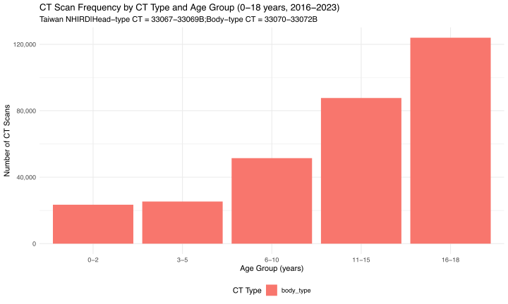
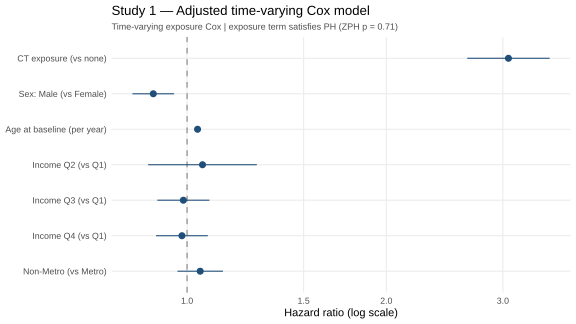
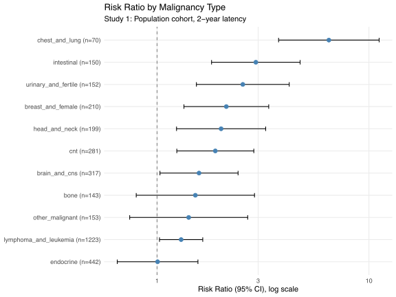
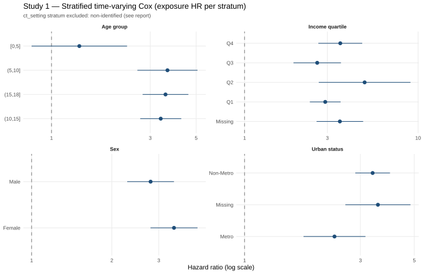
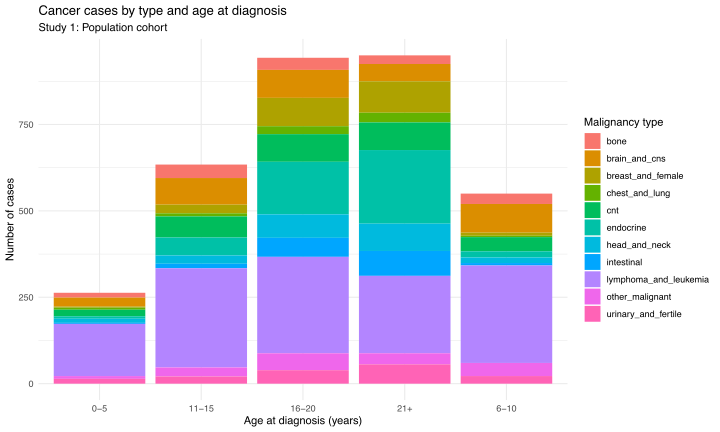
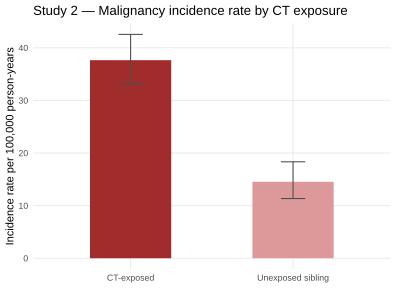
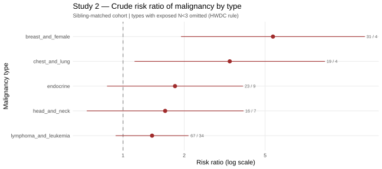
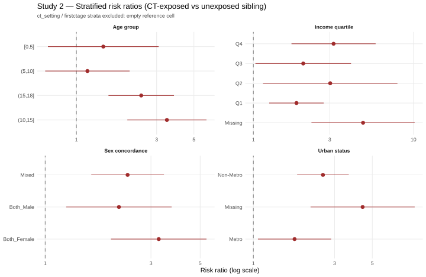
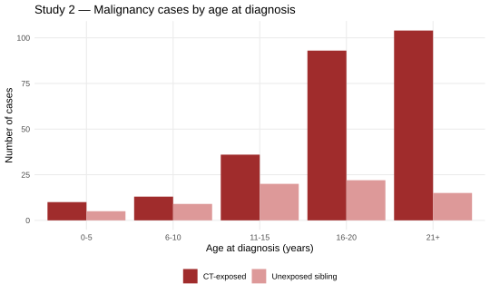

# 2026-05-27

# Taiwan CT Scan Exposure → Childhood Malignancy
## Study 1 & Study 2 — Methods, Results, and Comparison with the 2026-05-08 Note

---

## 1. What Changed Since the 2026-05-08 Note

The 2026-05-08 note used the earlier pipeline. The current pipeline is a
substantial rewrite. The key methodological changes:

| Area | 2026-05-08 | Current |
|---|---|---|
| Study 1 primary model | Linear / Logistic / fixed-index Cox (three models) | **Single time-varying exposure Cox** |
| Study 1 index date | Exposed: first CT; Unexposed: fixed 2016-01-01 — **asymmetric** | Both groups share one time origin |
| Study 2 primary model | Unstratified Cox on extended cohort | **Stratified Cox, one stratum per sibling pair** |
| Latency | Uniform 2 years | Uniform 2 years (primary); type-specific available as sensitivity |
| CT setting | Not captured | ER vs Clinic recorded for each scan |
| Income definition | Premium amount only | Non-wage insurance categories excluded |

The most important point: the 2026-05-08 note assumed the elevated hazard ratio
was mainly an artefact of the asymmetric index date. That asymmetry has now been
corrected, and **the hazard ratio did not fall** — Study 1 went from 2.77 to
**3.06**. This redirects the likely source of inflation away from study design
and toward short latency / reverse causation (§7).

---

## 2. Common Methods

**Data.** Taiwan NHIRD, 2000–2023. CT procedures are identified from outpatient
order records (head CT 33067B–33069B; body CT 33070B–33072B). Malignancy is
ascertained from the first diagnosis field, using ICD-9-CM (1996–2015, codes
140–208) and ICD-10-CM (2016–2023, codes C00–C97), grouped into 11 clinical
types. The current extract contains outpatient orders only; inpatient CT orders
are not captured.

**Cohort eligibility.** Children aged 0–18 during 2016–2023 with valid NHI
enrollment. Two exclusions apply to both studies: any malignancy diagnosed before
the person's start of follow-up, and any recorded hereditary cancer syndrome.

**Latency.** A malignancy is counted as an outcome only if it occurs more than
2 years after the index date; earlier diagnoses are treated as reverse causation
and excluded.

**CT distribution.** All CT scans in the cohort are body-type; the head-type
codes returned no records, which is a known data issue under investigation.
Roughly 70% of scans are ordered in the emergency setting.

---

## 3. Study 1 — Population Cohort

### 3-1. Design

All eligible children are compared as CT-exposed versus unexposed. The model
adjusts for sex, age, income quartile, and urban/non-metro residence.

### 3-2. Time Definitions (Entry / Index / Transfer / Exit)

Study 1's primary analysis is a **time-varying exposure Cox model**. The time
scale is calendar time, common to both groups, with four key dates per person:

- **Entry** — the later of 2016-01-01 or the child's birth date. This is when the
  person starts contributing person-time.
- **Index date** — first CT date for exposed children, or 2016-01-01 for
  unexposed children. Used to derive baseline age and to apply the latency rule.
- **Transfer point** (exposed only) — first CT date plus a 2-year lag. Before
  this point the child contributes *unexposed* person-time; on or after it,
  *exposed* person-time.
- **Exit** — the earliest of malignancy diagnosis, or 2023-12-31. Person-time
  ends here.

Each unexposed child contributes one interval (entry → exit, unexposed
throughout). Each exposed child is split into two intervals: entry → transfer
(counted as unexposed) and transfer → exit (counted as exposed). If the child
exits before the transfer point, the whole interval is unexposed.

**Why this matters.** In the 2026-05-08 pipeline the exposed group's clock
started at the CT date while the unexposed group's started at a fixed date — an
unfair comparison that inflated the hazard ratio. The time-varying scheme gives
both groups the same origin and lets a CT count as "exposure" only after it
actually happens (plus the latency lag). This is the methodologically correct
specification.

### 3-3. Statistical Model

A single Cox proportional-hazards model on the time-varying cohort: exposure
status (time-varying) plus sex, baseline age, income quartile, and urban status.
The proportional-hazards assumption is tested with Schoenfeld residuals.
Stratified models (one per stratum) and an exposure-dose model (number of CT
scans) are run as secondary analyses.

### 3-4. Baseline Characteristics — Study 1

| Characteristic | Category | Overall | CT-exposed | Unexposed | SMD | p |
|---|---|---|---|---|---|---|
| Total participants |  | 4,194,193 | 198,167 | 3,996,026 |  |  |
| Person-years of follow-up |  | 24,576,434 | 620,161 | 23,956,273 |  |  |
| Follow-up time (months) | Median [IQR] | 72.0 [72.0, 72.0] | 38.4 [19.7, 55.3] | 72.0 [72.0, 72.0] | 2.357 | <0.001 |
| Sex | Female | 2,014,317 (48.0%) | 79,286 (40.0%) | 1,935,031 (48.4%) | 0.240 | <0.001 |
|  | Male | 2,179,876 (52.0%) | 118,881 (60.0%) | 2,060,995 (51.6%) |  |  |
| Age at index (years) | Median [IQR] | 10.0 [4.0, 15.0] | 14.0 [8.0, 17.0] | 10.0 [4.0, 15.0] | 0.485 | <0.001 |
| Age at study start (years) | Median [IQR] | 10.0 [4.0, 15.0] | 11.0 [5.0, 14.0] | 10.0 [4.0, 15.0] | 0.017 | 0.074 |
| Age at first CT (years, exposed only) | Median [IQR] | 14.0 [8.0, 17.0] | 14.0 [8.0, 17.0] | — | — | — |
| Age at first CT group | 0-5 | 33,759 (17.0%) | 33,759 (17.0%) | 0 (0.0%) | 1.529 | <0.001 |
|  | 6-10 | 32,271 (16.3%) | 32,271 (16.3%) | 0 (0.0%) |  |  |
|  | 11-15 | 55,338 (27.9%) | 55,338 (27.9%) | 0 (0.0%) |  |  |
|  | 16-18 | 76,799 (38.8%) | 76,799 (38.8%) | 0 (0.0%) |  |  |
| Age at malignancy diagnosis (years, events) | Median [IQR] | 17.0 [11.0, 21.0] | 20.0 [16.0, 22.0] | 17.0 [10.0, 21.0] | 0.507 | <0.001 |
| Age at diagnosis group (events) | 0-5 | 263 (7.9%) | 11 (4.3%) | 252 (8.2%) | 0.615 | <0.001 |
|  | 6-10 | 550 (16.5%) | 12 (4.7%) | 538 (17.4%) |  |  |
|  | 11-15 | 634 (19.0%) | 30 (11.9%) | 604 (19.6%) |  |  |
|  | 16-20 | 943 (28.2%) | 90 (35.6%) | 853 (27.6%) |  |  |
|  | 21+ | 950 (28.4%) | 110 (43.5%) | 840 (27.2%) |  |  |
| Income quartile | Q1 | 1,620,285 (38.6%) | 79,877 (40.3%) | 1,540,408 (38.5%) | 0.163 | <0.001 |
|  | Q2 | 138,780 (3.3%) | 10,624 (5.4%) | 128,156 (3.2%) |  |  |
|  | Q3 | 928,642 (22.1%) | 39,983 (20.2%) | 888,659 (22.2%) |  |  |
|  | Q4 | 945,008 (22.5%) | 37,551 (18.9%) | 907,457 (22.7%) |  |  |
|  | Missing | 561,478 (13.4%) | 30,132 (15.2%) | 531,346 (13.3%) |  |  |
| Urban status | Metro | 1,138,214 (27.1%) | 52,219 (26.4%) | 1,085,995 (27.2%) | 0.076 | <0.001 |
|  | Non-Metro | 2,493,629 (59.5%) | 114,953 (58.0%) | 2,378,676 (59.5%) |  |  |
|  | Missing | 562,350 (13.4%) | 30,995 (15.6%) | 531,355 (13.3%) |  |  |
| CT setting at first scan | Clinic | 54,046 (27.3%) | 54,046 (27.3%) | — |  |  |
|  | ER | 144,121 (72.7%) | 144,121 (72.7%) | — |  |  |
| Number of CT scans | 1 | 156,338 (78.9%) | 156,338 (78.9%) | — |  |  |
|  | 2-3 | 36,987 (18.7%) | 36,987 (18.7%) | — |  |  |
|  | ≥4 | 4,842 (2.4%) | 4,842 (2.4%) | — |  |  |
| Malignancy events |  | 3,340 (0.08%) | 253 (0.13%) | 3,087 (0.08%) |  |  |

The exposed group is older and more male. CT-exposed children have a higher
crude malignancy proportion.

### 3-5. Incidence Rate

| Group | Events | Person-years | Rate per 100,000 PY (95% CI) |
|---|---|---|---|
| CT-exposed | 253 | 620,161 | 40.8 (35.9–46.1) |
| Unexposed | 3,087 | 23,956,273 | 12.9 (12.4–13.3) |

### 3-6. Primary Result — Adjusted Time-Varying Cox

| Variable | HR (95% CI) |
|---|---|
| **CT exposure (vs none)** | **3.06 (2.65–3.53)** |
| Sex: Male (vs Female) | 0.89 (0.83–0.96) |
| Age at baseline (per year) | 1.04 (1.03–1.04) |
| Income Q2–Q4 (vs Q1) | ~0.98–1.06, all non-significant |
| Non-Metro (vs Metro) | 1.05 (0.97–1.13) |

The exposure term **satisfies the proportional-hazards assumption**
(test p = 0.71) — a clear improvement over the 2026-05-08 model, where the
assumption was strongly violated. The global test is still significant, driven
by the age term.

### 3-7. Crude Risk Ratio by Malignancy Type

The strongest associations are in solid tumours commonly investigated by CT
(chest/lung RR 6.5, intestinal 2.9, urinary 2.5, breast 2.1, head/neck 2.0).
Leukaemia/lymphoma — the malignancy least likely to be diagnosed by CT and the
most biologically established radiation-related cancer — shows the lowest RR
(1.3). This pattern is more consistent with reverse causation than with a
radiation effect, which would predict the opposite ordering.

### 3-8. Stratified and Descriptive Figures

Stratified hazard ratios are broadly consistent across sex, age group, income,
and urban status (all elevated, roughly 2.3–3.6).

---

## 4. Study 2 — Sibling-Matched Cohort

### 4-1. Design and Rationale

Study 1 cannot adjust for shared family factors — inherited cancer
susceptibility, parental behaviour, common environment. Study 2 compares each
CT-exposed child with an **unexposed sibling**, who shares the family environment
and about half the genetic background. Any association surviving sibling
matching is less likely to be family-level confounding.

### 4-2. Sibling Identification

Two children are defined as siblings if they share the same effective father or
the same effective mother in the household relationship file. Each pair must
have one CT-exposed and one CT-unexposed member; the unexposed sibling must have
no CT record and no prior malignancy. Each pair is labelled by sex composition
(both male / both female / mixed).

### 4-3. Time Definitions

The unexposed sibling **inherits the exposed sibling's index date**, so both
members of a pair share a common time origin and the same latency window. Age at
index, follow-up time, and the 2-year latency rule are then applied exactly as
in Study 1. Because the two siblings share an index date by construction, the
fixed-index time scale used here does not create the asymmetry that Study 1's
time-varying model was designed to fix.

### 4-4. Statistical Model

The primary analysis is a **stratified Cox model with one stratum per sibling
pair**. Each pair has its own baseline hazard, which absorbs all unmeasured
factors shared within the family. This is the standard matched-pair approach.
A consequence is that only pairs with within-pair variation in outcome (one
sibling develops cancer, the other does not) contribute information, so the
effective sample shrinks and some estimates become unstable (§7).

### 4-5. Baseline Characteristics — Study 2

| Characteristic | Category | Overall | CT-exposed | Unexposed sibling | SMD | p |
|---|---|---|---|---|---|---|
| Total participants |  | 378,682 | 222,095 | 156,587 |  |  |
| Person-years of follow-up |  | 1,168,536 | 679,968 | 488,568 |  |  |
| Follow-up time (months) | Median [IQR] | 37.7 [19.4, 54.6] | 37.3 [19.1, 54.2] | 38.2 [19.7, 55.1] | 0.034 | <0.001 |
| Sex | Female | 169,847 (44.9%) | 91,977 (41.4%) | 77,870 (49.7%) | 0.236 | <0.001 |
|  | Male | 208,835 (55.1%) | 130,118 (58.6%) | 78,717 (50.3%) |  |  |
| Age at index (years) | Median [IQR] | 13.0 [7.0, 16.0] | 14.0 [8.0, 17.0] | 11.0 [6.0, 15.0] | 0.336 | <0.001 |
| Age at study start (years) | Median [IQR] | 9.0 [4.0, 13.0] | 11.0 [5.0, 14.0] | 8.0 [3.0, 12.0] | 0.312 | <0.001 |
| Age at first CT (years, exposed only) | Median [IQR] | 14.0 [8.0, 17.0] | 14.0 [8.0, 17.0] | — | — | — |
| Age at first CT group | 0-5 | 37,995 (17.1%) | 37,995 (17.1%) | 0 (0.0%) | 1.526 | <0.001 |
|  | 6-10 | 37,708 (17.0%) | 37,708 (17.0%) | 0 (0.0%) |  |  |
|  | 11-15 | 65,113 (29.3%) | 65,113 (29.3%) | 0 (0.0%) |  |  |
|  | 16-18 | 81,279 (36.6%) | 81,279 (36.6%) | 0 (0.0%) |  |  |
| Age at malignancy diagnosis (years, events) | Median [IQR] | 19.0 [15.0, 21.0] | 20.0 [16.0, 22.0] | 16.0 [11.0, 20.0] | 0.568 | <0.001 |
| Age at diagnosis group (events) | 0-5 | 15 (4.6%) | 10 (3.9%) | 5 (7.0%) | 0.633 | <0.001 |
|  | 6-10 | 22 (6.7%) | 13 (5.1%) | 9 (12.7%) |  |  |
|  | 11-15 | 56 (17.1%) | 36 (14.1%) | 20 (28.2%) |  |  |
|  | 16-20 | 115 (35.2%) | 93 (36.3%) | 22 (31.0%) |  |  |
|  | 21+ | 119 (36.4%) | 104 (40.6%) | 15 (21.1%) |  |  |
| Income quartile | Q1 | 152,991 (40.4%) | 91,483 (41.2%) | 61,508 (39.3%) | 0.058 | <0.001 |
|  | Q2 | 18,742 (4.9%) | 11,314 (5.1%) | 7,428 (4.7%) |  |  |
|  | Q3 | 70,744 (18.7%) | 40,970 (18.4%) | 29,774 (19.0%) |  |  |
|  | Q4 | 65,032 (17.2%) | 36,891 (16.6%) | 28,141 (18.0%) |  |  |
|  | Missing | 71,173 (18.8%) | 41,437 (18.7%) | 29,736 (19.0%) |  |  |
| Urban status | Metro | 95,436 (25.2%) | 55,763 (25.1%) | 39,673 (25.3%) | 0.015 | 0.001 |
|  | Non-Metro | 210,446 (55.6%) | 123,952 (55.8%) | 86,494 (55.2%) |  |  |
|  | Missing | 72,800 (19.2%) | 42,380 (19.1%) | 30,420 (19.4%) |  |  |
| CT setting at first scan | Clinic | 57,178 (25.7%) | 57,178 (25.7%) | — |  |  |
|  | ER | 164,917 (74.3%) | 164,917 (74.3%) | — |  |  |
| Number of CT scans | 1 | 174,907 (78.8%) | 174,907 (78.8%) | — |  |  |
|  | 2-3 | 41,875 (18.9%) | 41,875 (18.9%) | — |  |  |
|  | ≥4 | 5,313 (2.4%) | 5,313 (2.4%) | — |  |  |
| Malignancy events |  | 327 (0.09%) | 256 (0.12%) | 71 (0.05%) |  |  |

A CT-exposed child may belong to more than one sibling pair, so the exposed
count here exceeds the number of distinct exposed individuals.

### 4-6. Incidence Rate and Primary Result

| Group | Rate per 100,000 PY (95% CI) |
|---|---|
| CT-exposed | 37.6 (33.2–42.6) |
| Unexposed sibling | 14.5 (11.3–18.3) |

**Primary stratified Cox: CT exposure HR 1.99 (1.43–2.76).** Sibling matching
attenuates the estimate relative to Study 1 (3.06 → 1.99), consistent with some
contribution from family-level confounding. The estimate nevertheless remains
well above published cohorts (Mathews 2013 ≈ 1.24; Korea 2025 leukaemia ≈ 1.07).

### 4-7. Results — Risk Ratio by Type and Stratified

Crude RR by type shows the same solid-tumour-dominant pattern as Study 1. Six of
eleven types are omitted because the exposed event count fell below the HWDC
disclosure threshold (N < 3).

Stratified RRs are elevated across all strata. The "Missing" income and urban
categories show the highest RRs (4.4–4.8), pointing to selection bias linked to
incomplete enrollment data.

---

## 5. Cross-Study Summary

| | Study 1 (Population) | Study 2 (Sibling-Matched) | Published baseline |
|---|---|---|---|
| CT–malignancy HR | 3.06 (2.65–3.53) | 1.99 (1.43–2.76) | 1.07–1.24 |
| Family confounding controlled | No | Yes | varies |
| Comparison | All unexposed children | Unexposed sibling | — |

The attenuation from Study 1 to Study 2 is in the expected direction. But even
the sibling-matched estimate is roughly 60–85% above published cohorts, so no
causal claim can be supported from the current numbers.

---

## 6. Pipeline Error to Resolve

During the enrollment-file build, merging the historical and main monthly chunks
fails with an internal `vctrs` error ("Negative `n` in `compact_rep()`") when the
two chunk results are row-bound. This is a known `vctrs` failure that occurs when
the two tables have incompatible column types or a malformed (zero/negative-
length) column — typically a column that is empty in one chunk and typed in the
other. The fix is to align the column types of the two chunks before binding them
(coerce both to a common schema, and drop any all-empty columns first). The
enrollment-derived income and urban variables cannot be rebuilt until this is
resolved.

---

## 7. Known Problems and Open Issues

### Outputs that are currently broken

- **Study 1 stratification by CT setting.** Hazard ratios of order 10⁸ with
  uninformative confidence intervals. CT setting (ER vs Clinic) only exists for
  exposed children, so a stratum restricted to one setting has essentially no
  unexposed comparison group and the model cannot be estimated. Excluded from all
  figures until the design is reworked.
- **Study 2 income and urban Cox coefficients.** One income coefficient is of
  order 10⁶ with an infinite confidence interval. This is a separation artefact:
  after pair stratification, too few informative pairs remain to estimate these
  covariates. The exposure hazard ratio itself is plausible, but the income and
  urban covariate estimates should not be reported.
- **Study 2 stratification by CT setting and by first-CT age.** The reference
  (unexposed) cells are empty, so no risk ratio can be computed. Excluded from
  the figures.
- **CT type all body-type.** The head-type CT codes returned no records. Head/
  body stratified analyses are not yet trustworthy.

### Substantive issues carried forward

- **Hazard ratio did not fall after the design fix.** Correcting the index-date
  asymmetry did not reduce the estimate. The remaining inflation most likely
  comes from a uniform 2-year latency being too short for solid tumours. The
  type-specific latency analysis (2 years for blood cancers, 5 years for solid
  tumours) should be run to test this.
- **CT exposure rate is implausibly low (~3.6%).** Inpatient CT orders are not in
  the current data extract, so all CTs performed during hospital admission are
  missing. This requires a data-access expansion.
- **Missing-data strata show elevated risk** in both studies, indicating
  selection bias tied to incomplete enrollment records.

### Recommended order of work

1. Fix the enrollment-chunk merge error (§6) so income and urban can be rebuilt.
2. Fix or formally drop the broken outputs above so figures rest on valid numbers.
3. Run the type-specific latency analysis — the key test of whether the elevated
   estimates are a reverse-causation artefact.
4. Pursue inpatient CT data access to resolve the low exposure rate.

---

## 8. Questions Before Proceeding

1. **Study 1 CT-setting stratification** — drop entirely, or redefine as a
   sub-cohort analysis (restrict the exposed group to clinic-only CT and compare
   against all unexposed)?
2. **Study 2 covariate reporting** — is it acceptable to report only the exposure
   hazard ratio and note that income/urban covariates are non-identified under
   sibling stratification?
3. **Type-specific latency** — should this be promoted to a co-primary analysis,
   or kept as a sensitivity analysis?
4. **Study 3** — currently suspended; confirm it stays out of scope for now.